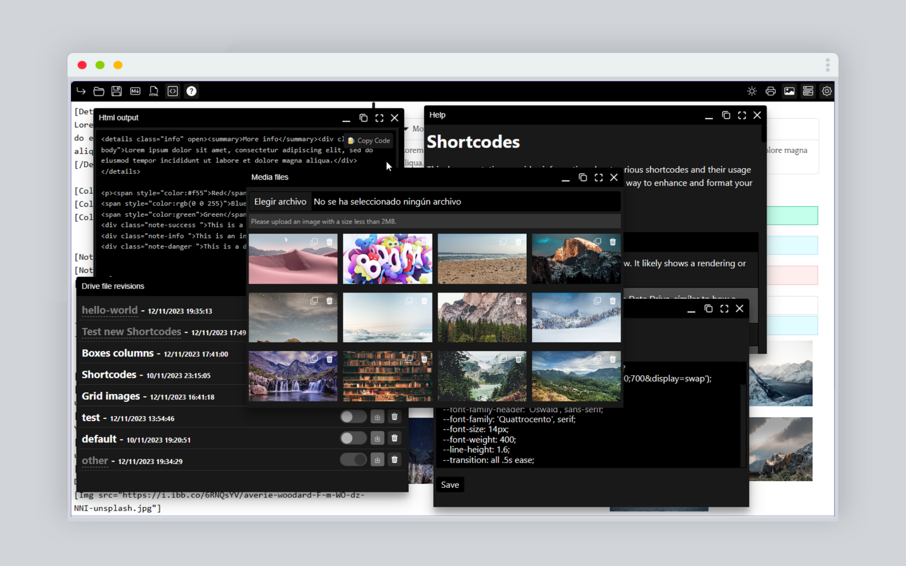

### Hi i'm Mark.. Markdroids

I'm a Markdown editor but special, Why?, because i have Shortcodes.

**What can Markdroids do?**

- Rich Markdown Editing: I offer a user-friendly interface for creating and editing Markdown documents with a visual approach.

- Custom Shortcodes: Enhance your content using Shortcodes, which effortlessly apply various functions and styles without the need for manual Markdown coding.

- Text Alignment: Utilize Shortcodes to align text to the left, right, center, or justify, ensuring precise text layout.

- Table Creation: Easily generate tables using Shortcodes, streamlining the process of creating complex tables.

- Task Lists: Create to-do lists with Shortcodes for managing tasks and pending items.

- Column Layouts: Divide your content into columns with Shortcodes, facilitating information organization in multi-column designs.

- Colorful Notes: Craft highlighted notes in various colors with Shortcodes, making it easy to emphasize essential information.

- HTML Export: Save your work in Markdown and HTML formats for seamless integration with other systems and platforms.

- Contextual Menu: A contextual menu is available with all Shortcodes and shortcuts for inserting Lorem Ipsum text, tasks, tables, and headers, enhancing your productivity.

- Custom CSS: You can customize the styling of your content using your own CSS.

ShortCodes
==========

This documentation provides information about various ShortCodes and their usage within your application. Shortcodes are an efficient way to enhance and format your content with minimal effort.

### Icon List Information

| **Icon** | **Description**  |
|-----------|-------------|
|      | This icon is used to trigger a render preview. It likely shows a rendering or preview of some content or design. |
|  | This icon is used to save content or data to Deta Drive, similar to how a floppy disk icon is traditionally associated with saving data. |
|  | Clicking this icon allows you to save a file in HTML format. |
| | Clicking this icon allows you to save a file in Markdown format.|
| | Clicking this icon allows to show Html output.|
| |This icon is associated with showing a dialog or modal that provides help and assistance to the user. It's often used to offer guidance or information about the application's features.|
| | This icon allows users to switch between light and dark modes. It's commonly found in applications to adjust the theme or appearance of the interface.|
| |Clicking this icon initiates the printing of a document or result, typically in a format suitable for a physical printer.|
| |Clicking on this icon will grant you access to the image gallery, allowing you to upload images for your document.|
| |Clicking this icon opens a dialog menu specifically for managing Deta drive files. It provides options for interacting with files stored in Deta Drive.|
| |Clicking this icon typically opens a settings menu, allowing users to customize the application, including options like changing custom CSS (Cascading Style Sheets).|

### List of ShortCodes

| **Shortcode** | **Description**  |
|-----------|-------------|
|Details |Use the details shortcode to create expandable sections |
|Color|Add color to your text using the color shortcode|
|Justify|Align your text with full justification.|
|Center|Center-align your text.|
|Right|Right-align your text.|
|Divider|Insert a simple divider to separate content.|
|Note|Create notes with different styles such as success, info, or danger.|
|Columns|Divide content into two or three columns for better readability.|
|Boxes/Box|Simple and easy responsive boxes.|
|Comment|Include comments to annotate your content.|
|Header|Generate Markdown headers to structure your content.|
|Tasks|Create task lists with checkboxes.|
|Table|Generate Markdown tables easily.|
|Img|Insert image with inside div with class option.|
|Grid|Wraps [Img] width grid class, perfect for galleries.|
|Lorem|Generate placeholder text (lorem ipsum).|
|Youtube|Embed Youtube videos by specifying the video ID.|
|Archive|Embed videos from Archive.org.|
|Dtube|Embed Dtube videos.|
|Dailymotion|Embed videos from Dailymotion.|

### Examples

Use the `Details`ShortCodes to create expandable sections that reveal additional information when clicked.

    [Details name="More info" open]Lorem ipsum dolor sit amet, consectetur adipiscing elit, sed do eiusmod tempor incididunt ut labore et dolore magna aliqua.[/Details]

    Change the text color using the `Color`ShortCodes.

    [Color name="#f55"]Red[/Color]
    [Color name="rgb(0 0 255)"]Blue[/Color]
    [Color name="green"]Green[/Color]

### Text-align

**Justify:**

Use the Justify ShortCode to fully justify your text.

    [Justify]Your fully justified text goes here.[/Justify]

**Right:**

Right-align your text using the Right ShortCode.

    [Right]Your right-aligned text goes here.[/Right]

**Divider**

Insert dividers to separate sections of your content.

    [Divider]

### Notes

**Note (Success)**

Create success notes to highlight important information.

    [Note name="success"]This is a success note.[/Note]

**Note (Info)**Generate informational notes to convey relevant details.

    [Note name="info"]This is an info note.[/Note]

**Note (Danger)**Use danger notes to alert readers about potential risks.

    [Note name="danger"]This is a danger note.[/Note]

### Columns **(Use only for text and images, use Boxes for other elements)**

Divide your content into multiple columns for a more organized presentation.

    [Columns num=2]Content for two columns goes here.[/Columns]

**Three Columns**

    [Columns num=3]Content for three columns goes here.[/Columns]

### Boxes

Simple and easy responsive boxes.

    [Boxes]
    [Box num=1] Column 1 [/Box]
    [Box num=1 class="extend class"] Column 1 [/Box]
        [/Boxes]

**2 Columns**

    [Boxes]
    [Box num=2] Column 1/2 [/Box]
    [Box num=2] Column 1/2 [/Box]
        [/Boxes]

Center Column 1/2

    [Boxes class="center"]
    [Box num=2] Column 1/2 [/Box]
        [/Boxes]

**3 Columns**

    [Boxes]
    [Box num=3] Column 1/3 [/Box]
    [Box num=3] Column 1/3 [/Box]
    [Box num=3] Column 1/3 [/Box]
        [/Boxes]

**4 Columns**

    [Boxes]
    [Box num=4] Column 1/4 [/Box]
    [Box num=4] Column 1/4 [/Box]
    [Box num=4] Column 1/4 [/Box]
    [Box num=4] Column 1/4 [/Box]
        [/Boxes]

### Grid

Combine with the ShortCode [Img] to create galleries.

**Note:** Grid only work with html or Img ShortCode. if you like use Markdown use `[Grid md]`and remember you can use custom css.

    [Grid]
    [Img src="https://i.ibb.co/D8TSt0T/atle-mo-h-KWXt-AXe-Xco-unsplash.jpg"]
    [Img src="https://i.ibb.co/NmdC1J3/alessandro-viaro-fw-Wj5-Y1-Ig-Qg-unsplash.jpg"]
    [Img src="https://i.ibb.co/t87wPBh/atle-mo-rqyq-OGf1-RV0-unsplash.jpg"]
    [Img src="https://i.ibb.co/Vt2SFZk/austin-schmid-65-F-502jo-DA-unsplash.jpg"]
    [Img src="https://i.ibb.co/6RNQsYV/averie-woodard-F-m-WO-dz-NNI-unsplash.jpg"]
    [Img src="https://i.ibb.co/NLsFswB/chris-abney-q-P76-Vx1zps-unsplash.jpg"]
    [Img src="https://i.ibb.co/L84XfpV/christiann-koepke-9-IY4az8knqc-unsplash.jpg"]
    [Img src="https://i.ibb.co/XCRjJQJ/david-joyce-Etxza-BKEv-E4-unsplash.jpg"]
    [/Grid]

### Img

Extend Markdown image

// Basic
    [Img src="source"]

// Advanced
    [Img src="source" cls="wrap classname" href="url" alt="img description"]

### Comments

Include comments to provide additional context or explanations.

    [Comment]This is a comment.[/Comment]

### Videos

Embed videos from various platforms using dedicated ShortCodes.

    [Youtube id="YourYoutubeVideoID" width="100%" height="100%"]

**Archive.org**[https://archive.org/embed/](https://archive.org/embed/)fansub\_Chobits

    [Archive id="YourArchiveVideoID" width="100%" height="100%"]

**Dtube**

    [Dtube id="YourDtubeVideoID" width="100%" height="100%"]

**Dailymotion**

    [Dailymotion id="YourDailymotionVideoID"]

This documentation serves as a comprehensive guide to using these ShortCodes effectively. Experiment with them to enhance the presentation of your content and provide a richer user experience.

### Api

List of available endpoints

    // Get all public files
    [url]/api/json/all
    // Get only one
    [url]/api/json/[uid]
    // Get all photos
    [url]/api/json/photos

**Uid is a Json with key and update in base64.**